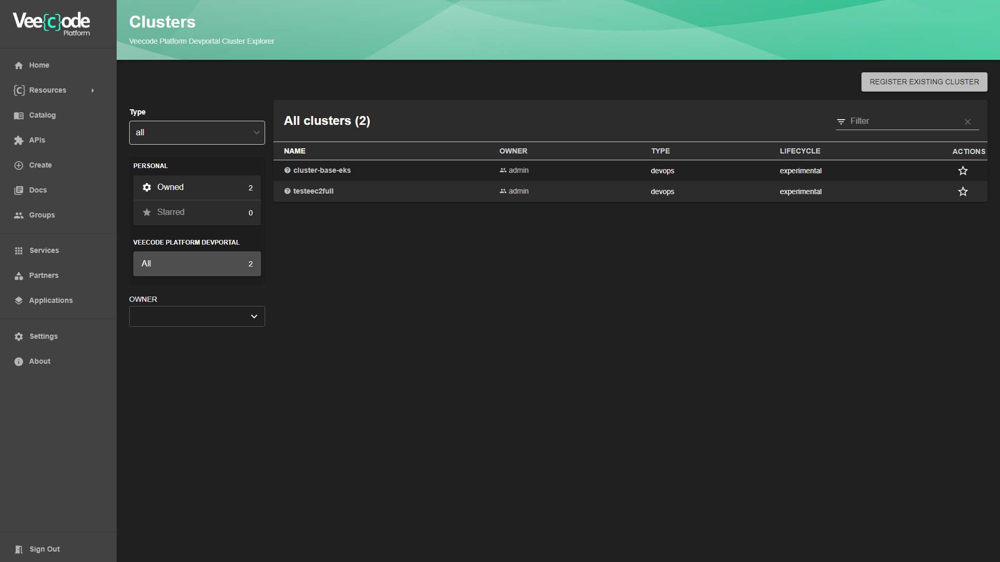
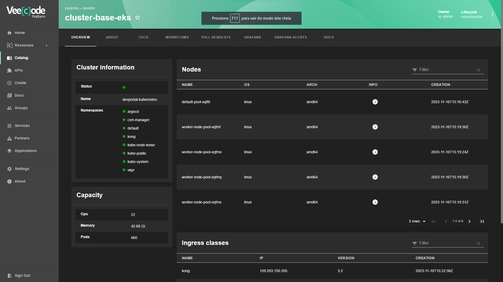

# Cluster Explorer Plugin

The Cluster plugin has two approaches:

- A list of the Clusters available in your catalog

- A k8s cluster overview with all its data and relationships within the catalog.


⚠️ It is important to note that the `Cluster` is a **Kind** customized by the **VeeCode Platform** and therefore it requires the installation of the `veecode-platform-common` plugin in order to work.

To install the `veecode-platform-common` plugin click [here](https://github.com/veecode-platform/platform-backstage-plugins/tree/master/plugins/veecode-platform-common).

Okay, given that you already have a properly configured environment, let's start our installation.

## Get Started

```bash
cd packages/app
yarn add @veecode-platform/plugin-cluster-explorer
```
Now, in the file `packages > app > src > App.tsx`:

```diff
...
+ import { clusterExplorerPage } from '@veecode-platform/plugin-cluster-explorer';

...

const routes = (
<FlatRoutes>
+ <Route path="/cluster-explorer" element={<clusterExplorerPage/>}/>
</FlatRoutes>
)
...
```
To add a menu to your sidebar, just follow these steps:
`packages > app > src > components > Root > Root.tsx `

In the example, we've added an external icon, using the lib `react-icons`.

```bash
cd packages/app
yarn add react-icons
```

```diff

...
+ import { Imcluster } from "react-icons/im";

...

export const Root = ({ children }: PropsWithChildren<{}>) => (
  <SidebarPage>
    <Sidebar>
      <SidebarLogo />
      <SidebarGroup label="Search" icon={<SearchIcon />} to="/search">
        <SidebarSearchModal />
      </SidebarGroup>
      <SidebarDivider />
      <SidebarGroup label="Menu" icon={<MenuIcon />}>
        <SidebarItem icon={HomeIcon} to="catalog" text="Home" />
        <SidebarItem icon={ExtensionIcon} to="api-docs" text="APIs" />
        <SidebarItem icon={LibraryBooks} to="docs" text="Docs" />
+        <SidebarItem icon={Imcluster} to="cluster-explorer" text="clusters" />
        <SidebarItem icon={CreateComponentIcon} to="create" text="Create..." />
        <SidebarDivider />
        <SidebarScrollWrapper>
          <SidebarItem icon={MapIcon} to="tech-radar" text="Tech Radar" />
        </SidebarScrollWrapper>
      </SidebarGroup>
      <SidebarSpace />
      <SidebarDivider />
      <SidebarGroup
        label="Settings"
        icon={<UserSettingsSignInAvatar />}
        to="/settings"
      >
        <SidebarSettings />
      </SidebarGroup>
    </Sidebar>
    {children}
  </SidebarPage>
);
```
Or you can create a "Resources" menu and add "clusters" as a submenu:

```diff
...

+ import BusinessIcon from '@material-ui/icons/Business';
+ import { Imcluster } from "react-icons/im";

...

export const Root = ({ children }: PropsWithChildren<{}>) => (
  <SidebarPage>
    <Sidebar>
      <SidebarLogo />
      <SidebarGroup label="Search" icon={<SearchIcon />} to="/search">
        <SidebarSearchModal />
      </SidebarGroup>
      <SidebarDivider />
      <SidebarGroup label="Menu" icon={<MenuIcon />}>
        <SidebarItem icon={HomeIcon} to="catalog" text="Home" />
        <SidebarItem icon={ExtensionIcon} to="api-docs" text="APIs" />
        <SidebarItem icon={LibraryBooks} to="docs" text="Docs" />
+          <SidebarItem icon={BusinessIcon} text="Resources">
+            <SidebarSubmenu title="">
+              <SidebarDivider />
+              <SidebarSubmenuItem
+                title="clusters"
+                to="cluster-explorer"
+                icon={Imcluster}
+              />
+
+            </SidebarSubmenu>
+          </SidebarItem>
        <SidebarItem icon={CreateComponentIcon} to="create" text="Create..." />
        <SidebarDivider />
        <SidebarScrollWrapper>
          <SidebarItem icon={MapIcon} to="tech-radar" text="Tech Radar" />
        </SidebarScrollWrapper>
      </SidebarGroup>
      <SidebarSpace />
      <SidebarDivider />
      <SidebarGroup
        label="Settings"
        icon={<UserSettingsSignInAvatar />}
        to="/settings"
      >
        <SidebarSettings />
      </SidebarGroup>
    </Sidebar>
    {children}
  </SidebarPage>
);
```
And that's the view:

By clicking on the icon in the side menu:

- cluster Listing:




- cluster Overview:




1- Setting up the kubernetes config in the `app-config.yaml`:

```yaml
kubernetes:
  serviceLocatorMethod:
    type: multiTenant
  clusterLocatorMethods:
    - type: "config"
      clusters:
        - url: ${KUBERNETES_URL}
          name: ${NAME}
          authProvider: serviceAccount
          skipTLSVerify: false
          skipMetricsLookup: false
          serviceAccountToken: ${KUBERNETES_SERVICE_ACCOUNT_TOKEN}
          caData: ${KUBERNETES_CERTIFICATE_DATA}
```


## How to add annotation `cluster/instructions`:

The `cluster/instruction` annotation is based on a block of text with instructions for raising the cluster, according to its type.
It needs to be filled in the cluster's `catalog-info.yaml` as shown in the example:

```diff
apiVersion: veecode.backstage.io/v1alpha1
kind: Cluster
metadata:
  name: "ec2-cluster-2"
  annotations:
    github.com/project-slug: xxxxxxxxxxxxxxxx
    backstage.io/techdocs-ref: dir:.
+    cluster/instructions: |
+      mkdir test
+      echo 'hello world'
spec:
  type: ec2
  lifecycle: development
  owner: "admin"
```

This way, we'll have a card on the Cluster Overview Page with instructions on how to set up the cluster correctly.


## How to reuse the resources of the Cluster entity

In the context we envisioned for the project, the Cluster is used to reuse information that will be useful when creating new entities for our catalog.

We have developed customizable components to provide the scaffolder with the possibility of parsing information from the **environment** key of our **Kind**.

This is our **ResourcePicker**, [➡️ here's how to install it.](https://github.com/veecode-platform/platform-backstage-plugins/tree/master/plugins/veecode-scaffolder-extensions)

With it we can approach the reuse of this information when creating entities via a template.

Example:

```yaml
    - title: Cluster Settings
      properties:
        clusterResource:
          title: Select the Cluster from our catalog
          type: object
          ui:field: ResourcePicker
          ui:options:
            catalogFilter:
              kind: [Cluster]
```
In this case, we will list all our entities in the catalog that have the **Cluster** kind, and under the hood we will scan the `metadata.enviromnet` key of the chosen entity, and thus parse the information as **values** to serve the **skeleton** of our template.

example:

```yaml
...
  steps:
    - id: template
      name: Fetch Skeleton + Template
      action: fetch:template
      input:
        url: ./skeleton      
        values:
          dns: ${{ parameters.clusterResource.type }}

...
```

ℹ️ Remember to validate that the selected entity has this property, otherwise the values will be empty.
